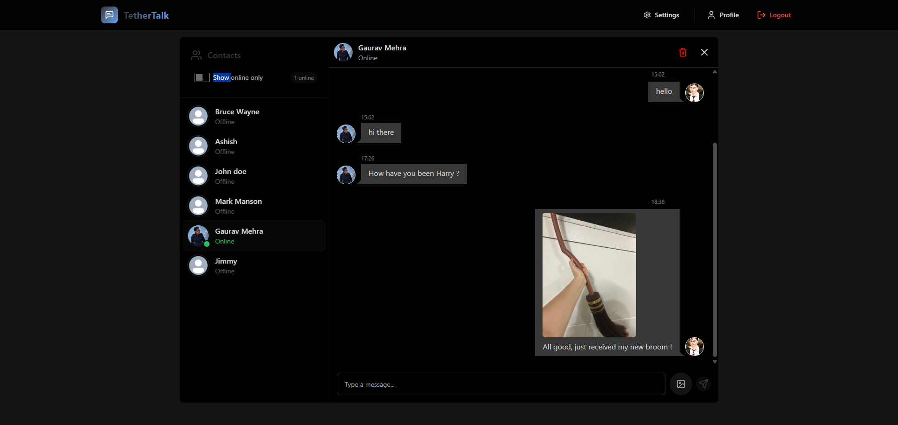
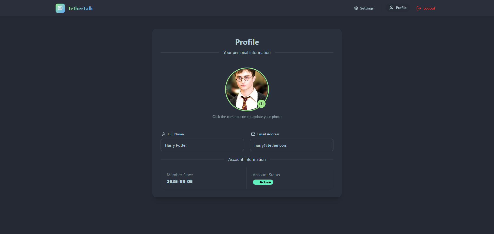

# 🌟 TetherTalk - MERN Stack Chat App 🌟

👋 Welcome to TetherTalk, a Full Stack Realtime Chat App 📱. This project leverages the latest technologies to provide a seamless, engaging, and visually appealing user experience 🌈.

**Product Images:**

📸 
📸 

**Tech Stack:**

- **ViteJS**: A modern development server that provides fast and efficient project setup and management, ensuring a smooth development process.
- **Tailwind CSS**: A utility-first CSS framework for rapid UI development, allowing for a consistent and visually appealing design.
- **Zustand**: A state management library for React applications, simplifying state management and ensuring a scalable architecture.
- **Socket.io**: A JavaScript library for real-time communication over the web, enabling instant messaging and live updates.
- **MongoDB**: A NoSQL document-based database for storing and managing data, providing flexibility and scalability.
- **Mongoose**: A MongoDB ORM for Node.js that simplifies database interactions, making data management more efficient.

**Features:**

- **Authentication (JWT)** 🔒: Secure user authentication using JSON Web Tokens, ensuring a high level of security and trust.
- **Active Users** 👥: Real-time tracking of active users, enhancing the overall user experience and encouraging engagement.
- **Realtime Messaging** 📱: Instant messaging capabilities for seamless communication, making it easy to connect with others.
- **Image Upload** 📸: Users can share images with each other, adding a visual element to the chat experience and making it more enjoyable.
- **Deleting Conversation** 🚮: Users can delete conversations, ensuring a clean and organized chat history and promoting a clutter-free interface.
- **Profile Update** 📝: Users can update their profiles, including profile pictures and other information, allowing for personalization and self-expression.
- **Beautiful Themes (with Daisy)** 💐: A visually appealing theme system, including the Daisy theme, to enhance the user interface and provide a unique look and feel.

**Setting Up the Environment Variables:**

📝 To ensure the app runs smoothly, you need to configure the environment variables in the `.env` file. Please follow the format below:

```js
MONGODB_URI=your_mongodb_uri_here
PORT=5001
JWT_SECRET=your_jwt_secret_here

CLOUDINARY_CLOUD_NAME=your_cloudinary_cloud_name_here
CLOUDINARY_API_KEY=your_cloudinary_api_key_here
CLOUDINARY_API_SECRET=your_cloudinary_api_secret_here

NODE_ENV=development
CLIENT_URL=http://localhost:5173 // Ensure this matches your VITE_API_URL
```

Additionally, you need to configure Vite-specific environment variables in the `.env` file:

```js
VITE_API_URL=http://localhost:5173
VITE_MODE=development
```

**Starting the App Locally:**

🚀 To start the app locally, follow these steps:

**Backend:**

1. Navigate to the `/backend` directory in your terminal.
2. Install the required packages `npm install`.
3. Run `npm run dev` to start the backend server.
4. The backend server will be running on `http://localhost:5001`.

**Frontend:**

1. Navigate to the `/frontend` directory in your terminal.
2. Install the required packages `npm install`.
3. Run `npm run dev` to start the frontend server.
4. The frontend server will be running on `http://localhost:5173`.

Open your web browser and navigate to `http://localhost:5173` to access the app 📱.
